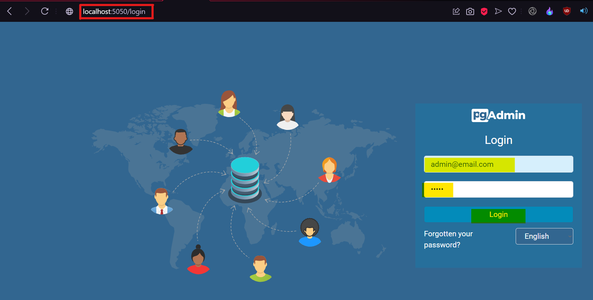

# Hypothetical E-Commerce Project (Nest.js):
## Microservices:
1. ### Product Service
2. ### User Service

---

* ## NOTE if you're checking commit messages:
    * I used commit message `prefix` as <span style="color:yellow;"> [NM-${COMMIT_NUMBER}] </span> in this pattern `NM` abbrivation stands for Nest.js Microservice & `COMMIT_NUMBER` denotes the current number of commit except `init commit` which is initial commit, I followed this production based practice to keep a track of `Major` & `Minor` releases or projects.

* ## Steps to Get Started

1. #### Clone the repository:
    > git clone https://github.com/ChanderParkash179/nestjs-microservices.git

2. #### Open the project in your preferred coding editor like VSCode, IntelliJ IDEA, etc.

3. #### Open a terminal and install dependencies:
    > `npm install`

4. #### Start Docker containers for PostgreSQL and pgAdmin:
    > `docker-compose up` OR `docker-compose up -d`

5. #### Access pgAdmin in your browser do below stes:
    > * Type URL `http://localhost:5050/` hit enter and wait.
    > * Type email:  `admin@email.com` in email section.
    > * Type password: `admin` in password section and hit enter.

    > 

6. #### pgAdmin setup
    > * right click on `Server` and then click on `Register` and then `Server` like shown below:
         

    > * Now Click firstly on `General` tab and type `postgres` in name textbox like shown below:
        

    > * Now Go to `Connection` tab like shown below:
    > * Enter Host name/address: `postgres`, port: `5432`, Maintaince database: `postgres`, username: `postgres`, password: `postgres` and enable the `Save password` option:
        
        
7. #### Create two databases: `user` & `product` and wait for 30 seconds.
    > * open server `postgres` server, then open `Databases` after that right click on `Databases` and then on `Create` and then `Database...` for creating new database
         
    > * now enter name of database in textbox `user` or `product` and then click on `save`, repeat this process for both databases `user` & `product`:
        

8. #### Open a terminal in the `~root` path of the project and start the services by typing.
    > * `npm run start:dev`

9. #### Both microservices will be executed concurrently because I used concurrently package and updated `run` configuration in `package.json` file.

10. #### Now, you can test the provided tasks.

* ## Tasks

1. User should be able to register (Email, Password):
    - Endpoint:  `https://localhost:3001/user/register`
    - Method: `POST`
    - Authorization: `[NOT REQUIRED]`
    - NOTE: By Default Role is `NORMAL`, if you want to register as `ADMIN` if you want to register `ADMIN` user.
    - Payload:
     ```json
     {
       "name": "test",
       "email": "test@email.com",
       "password": "test",
       "role": "ADMIN" // Optional, defaults to "NORMAL"
     }
     ```

2. User should be able to login (Email, Password):
    - Endpoint: `https://localhost:3001/user/login`
    - Method: `POST`
    - Authorization: `[NOT REQUIRED]`
    - Payload:
     ```json
     {
       "email": "test@email.com",
       "password": "test"
     }
     ```

3. User should be able to get a list of products by pages and sort them based on the price:
    - Endpoint: `http://localhost:3001/user/products?page=2&limit=10&   order=DESC`
    - Method: `POST`
    - Authorization: Required using Login Token
    - Payload: `[NOT REQUIRED]`
    
4. User should be able to filter products by name:
    - Endpoint: `http://localhost:3001/user/products/filter?name=milk`
    - Method: `POST`
    - Authorization: Required using Login Token
    - Payload: `[NOT REQUIRED]`

5. User should be able to add a product:
    - Endpoint: `http://localhost:3001/user/product`
    - Method: `POST`
    - Authorization: Required using Login Token
    - Payload:
     ```json
     {
       "name": "chicken",
       "price": 721.10
     }
     ```

6. User should be able to see the product that he added:
    - Endpoint: `http://localhost:3001/user/products/:id`
    - Method: `GET`
    - Params: ID of the user
    - Authorization: Required using Login Token
    - Payload: `[NOT REQUIRED]`

7. An admin should be able to get a list of users:
    - Endpoint: `http://localhost:3001/user`
    - Method: `GET`
    - Authorization: Required using Login Token with role `ADMIN`
    - Payload: `[NOT REQUIRED]`

* ## Tech Stack & Used Packages

    - `Technologies`: Nest.js, TypeORM, Postgres (Database)
    - `Architecture`: Microservice
    - `Repository` Type: Single Package Mono-Repository
    - `Packages`: JWT, Passport (Passport JWT, Passport Local), Bcrypt, Microservices, Validator, Concurrently, Dotenv, UUID

* ## Developer Contacts

    - `Name`: Chander Parkash
    - `Email`: chanderparkash179@gmail.com
    - `Portfolio`: [https://chanderparkash.me](https://chanderparkash.me)
    - `LinkedIn`: [https://www.linkedin.com/in/chanderparkash179](https://www.linkedin.com/in/chanderparkash179)
    - `GitHub`: [https://www.github.com/ChanderParkash179](https://www.github.com/ChanderParkash179)
    - `Contact`: +971-54-265-9661 (`WhatsApp`)

---

* ## Motivation
> Don't forget to `Like` the Reop ✅😎